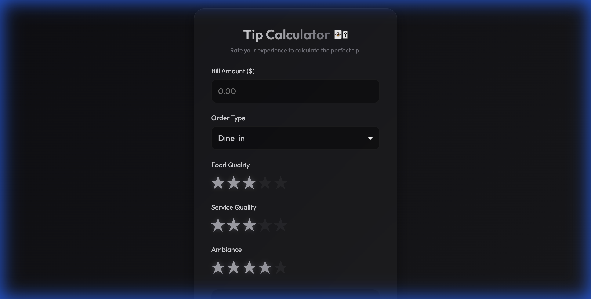
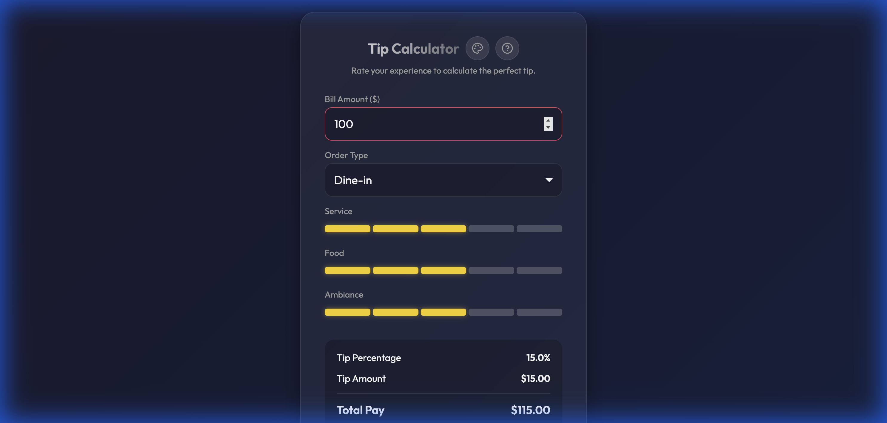
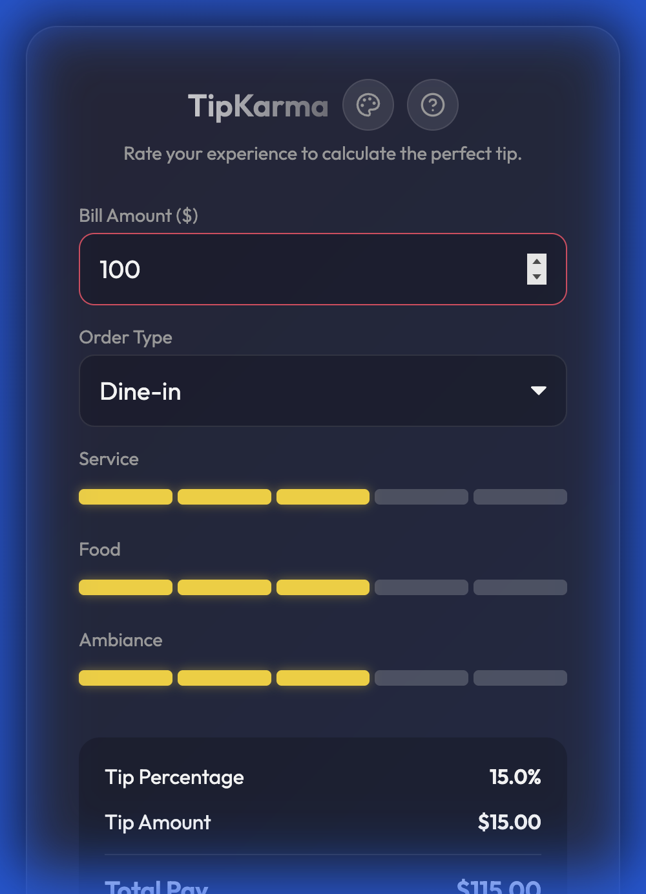

# TipKarma

**Give the tip they earned.**

TipKarma is a premium, scientifically-backed tip calculator designed to optimize your dining experience. It not only calculates the math but weighs the *Karma* of the service, food, and ambiance to suggest the perfect reward.

## Screenshots

  
  

  

## Features

-   **Karmic Algorithm**: Uses a non-linear formula `Tip% = Base + A * B` to calculate the perfect tip based on Service, Food, and Ambiance.
-   **Dual Themes**:
    -   **Stealth Mode (Default)**: A discreet, dark Zinc theme for low-profile usage.
    -   **Normal Mode**: A premium Dark/Gold/Pink theme for a richer visual experience.
-   **Context Aware**: Automatically disables "Ambiance" rating for Takeout orders because fairness matters.
-   **Privacy Focused**: All Karma calculations happen locally in your browser.
-   **Installable (PWA)**: Add to your home screen for instant access to tipping wisdom.

## Tech Stack

-   **Vite**: Fast build tool and dev server.
-   **Vanilla JS**: Lightweight and fast performance.
-   **CSS Variables**: Easy theming and maintainability.

## Getting Started

1.  Clone the repository.
2.  Run `npm install`.
3.  Run `npm run dev` to start the local server.
4.  Build for production with `npm run build`.

## License

MIT
